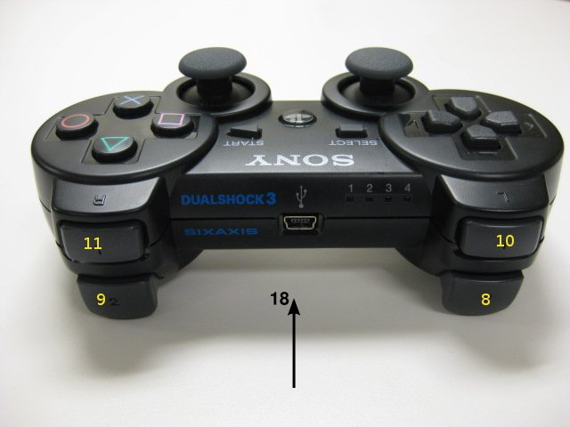

## Joy Convert

### 基本要求

完成`callback`函数

读取PS手柄数据，实现衰减输出相关信息

相关机器人参数

2个3D摇杆，一个实现前后，一个实现左右（http://wiki.ros.org/pr2_teleop似乎采取类似方法）

**总而言之，一个读取数值大小控制v，另一个读取角速度大小，其中保证前进速度快于后退速度**

---

### 自我实现

使用轴的部分

```
#define PS3_AXIS_STICK_LEFT_LEFTWARDS    0 左手柄左右
#define PS3_AXIS_STICK_LEFT_UPWARDS      1 左手柄上下
#define PS3_AXIS_STICK_RIGHT_LEFTWARDS   2 右手柄左右
#define PS3_AXIS_STICK_RIGHT_UPWARDS     3 右手柄上下

---

  linear_(1),
  angular_(3)
{
  nh_.param("axis_linear", linear_, linear_);
  nh_.param("axis_angular", angular_, angular_);
}
//命名类似
```

参数定义与赋值区域

```c++
float vc; // velocity of centor (m/s)
float wc; // angle velocity of centor (rad/s)
// convert from motor to m_output
// speed_motor(rpm) / reduce_ratio = m_outpit(rpm)
float reduce_ratio; 
// convert from rpm to wheel_speed, wheel_ration = 2 * pi * D(m)] / 60(s/min)
//  [m_outpit(rpm) * 2 * pi * D(m)] / 60(s/min) = wheel_speed(m/s)
float wheel_ration; 
float half_width; // half width between left and right wheel, 2c = width (m)
float a; // length between CoG and rear wheel (m)
float b; // length between CoG and front wheel (m)


float vc = 0; // (m/s)
float wc = 0; // (rad/s)

float vL, vR, vF, vB; // transition speed
float speed_motor[4]; //左前FL.右前FR.左后RL.右后RR

/********************************/

half_width = 0.6 // (m)
a = 0.4; // (m)
b = 0.4; // (m)
reduce_ratio = 3591.0 / 187.0;
wheel_ratio = 0.02;


```

callback

```c++
// angular.z = a_scale_*joy->axes[angular];
// twist.linear.x = l_scale_*joy->axes[linear];

/*记得写！
  linear_(1),
  angular_(3)
{

  nh_.param("axis_linear", linear_, linear_);
  nh_.param("axis_angular", angular_, angular_);
  nh_.param("scale_angular", a_scale_, a_scale_);
  nh_.param("scale_linear", l_scale_, l_scale_);

std_msgs::UInt8MultiArray
*/

vc = a_scale_*joy->axes[angular_];;
wc = linear.x = l_scale_*joy->axes[linear_];

//由v(L/R/F/B)过渡计算
vL = vc - half_width * wc;
vR = vc + half_width * wc;
vF = b * wc;
vB = -1 * a * wc;

// 导出左前FL.右前FR.左后RL.右后RR对应速度
//FL
speed_motor[0] = sqrt(vF * vF + vL * vL) * reduce_ratio / wheel_ratio; // (rpm)
//FR
speed_motor[1] = sqrt(vF * vF + vR * vR) * reduce_ratio / wheel_ratio; // (rpm)
//RLlinear_x_axis
speed_motor[2] = sqrt(vB * vB + vL * vL) * reduce_ratio / wheel_ratio; // (rpm)
//RR
speed_motor[3] = sqrt(vB * vB + vR * vR) * reduce_ratio / wheel_ratio; // (rpm)

//导出成串口数据输出

void process_send_data(uint8_t* send_buffer){
    float speed_motor[4]

    memcpy(speed_motor, rec_buffer, 4);
    memcpy(speed_motor+1, rec_buffer+4, 4);
    memcpy(speed_motor+2, rec_buffer+8, 4);
    memcpy(speed_motor+3, rec_buffer+12, 4);
    
    ROS_INFO_STREAM("Motors are running now") 
} 

---
    
上述部分出错！正在重写
```


```c++
本时刻摇杆值，上一时刻摇杆值记录
float ac_p, bc_p, ac_n, bc_n, ac, bc;//当前与上一时刻（角）加速度值
float dt;//更新频率对应的时间
float threshold;//用于衰减判定
float dv;//用于实际衰减
// 根据放大的情况
vthreshold = 1.0;
dv = 0.5;

//update now
    
ac_n = a_scale_*joy->axes[angular_];
bc_n = linear.x = l_scale_*joy->axes[linear_];

if(abs(ac_p - ac_n) <= vthreshold){
    ac = ac_p - dv
}
else {
    ac = ac_n;
}
vc += ac * dt;
wc += bc * dt;


//record past, initial value is 0
ac_p = ac;
bc_p = bc;
```


---

http://wiki.ros.org/ps3joy/Tutorials/WritingTeleopNode

```c++
//ros需要的头文件
#include "ros/ros.h"
#include <sensor_msgs/Joy.h> //joy/Joy.h 包含joys msg，使我们可以订阅读取joy
#include <std_msgs/UInt8MultiArray.h>

//以下为串口通讯需要的头文件
#include <string>        
#include <iostream>
#include <cstdio>
#include <unistd.h>
#include <math.h>

#define ZERO_DUTY (1455)
)
ros::Publisher send_pub;
float vc; // linear_x_axisvelocity of centor
float wc; // angle velocity of centor

void callback(const sensor_msgs::Joy::ConstPtr& msg){
    //实现将手柄转化为四轮分别的输出
}

int main(int argc, char **argv)
{
    ros::init(argc, argv, "pscontrol");//初始化节点
    ros::NodeHandle n;  //定义节点进程句柄
vc = 0;
    wc = 0;
    ros::Subscriber sub = n.subscribe("joy", 20, callback); //订阅自/listener主题
    //定义要发布/talker主题，超过20个舍弃
    ros::Publisher send_pub = n.advertise<std_msgs::UInt8MultiArray>("serial_send_mailbox", 20);       
    ros::Rate loop_rate(50); //50Hz

    float vc = 0;

    while(ros::ok())
    {      
        //获取串口发送来的数据
        // 数据与处理与判定
        vc = vc - 0.1;
        wc = wc - 0.1;

        if (vc < 0)
            vc = 0;

        if (wc  < 0)
            wc = 0;

        ros::spinOnce();//周期执行
        loop_rate.sleep();//周期休眠
        //ros::spin();
        //ROS_INFO_STREAM("Serial Running...");
        //程序周期性调用
        //ros::spinOnce();  //callback函数必须处理所有问题时，才可以用到
    }
    return 0;
}
```


---

https://www.2cto.com/kf/201709/678297.html

### 实现库

涉及的ROS主题：
1.没有订阅主题;
2.发布主题：”joy/joy”：发布的是操作手柄的输出，轴是[-1,1],按键是0或1.

参数：
“～dev”操作手柄的输入设备，默认为：/dev/input/js0
“~deadzone”当轴的值在该deadzone区间内，输出为0，范围是[-0.9,0.9],缺省是0.05,类似轴的灵敏度.
“~autorepeat_rate”如果无事件，按这个速率重复上一次的值，缺省为0.
“~coalesce_interval”:在这里设定的间隔内如果收到多个事件，只发出一个。缺省值是0.01.

---

### 别人例程

#### autorally

https://github.com/AutoRally/autorally/blob/kinetic-devel/autorally_control/src/joystick/JoystickControl.cpp

```c++
#include "JoystickControl.h"

JoystickControl::JoystickControl():
  throttleDamping_(0.0),
  steeringDamping_(0.0),
  throttleEnabled_(true),
  steeringEnabled_(true)
{
  m_joySub = nh_.subscribe("joy", 1, &JoystickControl::joyCallback, this);

  runstopPub_ = nh_.advertise
                 <autorally_msgs::runstop>
                 ("runstop", 1);

  commandPub_ = nh_.advertise
                 <autorally_msgs::chassisCommand>
                 ("joystick/chassisCommand", 1);

  runstop_.sender = "joystick";
  runstop_.motionEnabled = false;


  if(!nh_.getParam("joystickController/throttleDamping", throttleDamping_) ||
     !nh_.getParam("joystickController/steeringDamping", steeringDamping_) ||
     !nh_.getParam("joystickController/throttleAxis", throttleAxis_) ||
     !nh_.getParam("joystickController/steeringAxis", steeringAxis_) ||
     !nh_.getParam("joystickController/throttleEnableButton", throttleEnableButton_) ||
     !nh_.getParam("joystickController/steeringEnableButton", steeringEnableButton_) ||
     !nh_.getParam("joystickController/brakeAxis", brakeAxis_) )
  {
    ROS_ERROR_STREAM("Couldn't get joystick control parameters");
  }

  XmlRpc::XmlRpcValue v;
  nh_.param("joystickController/runstopToggleButtons", v, v);
  for(int i =0; i < v.size(); i++)
  {
    runstopToggleButtons_.push_back(v[i]);
  }

  runstopTimer_ = nh_.createTimer(ros::Rate(5),
                                   &JoystickControl::runstopCallback,
                                   this);

}

JoystickControl::~JoystickControl()
{}

void JoystickControl::joyCallback(const sensor_msgs::Joy::ConstPtr& joy)
{
  /* axes[0] is left/right of left sitck, axes[3] is up/down of right stick
   * I scale the range of values from the joystick [-1,1] to the range of
   * valid command values [-1.0, 1.0], and reverse the steering command so it
   * is drives as expected.
   */

  //toggle runstop if a runstop toggle button changed from 0 to 1
  for(auto vecIt : runstopToggleButtons_)
  {
    if(joy->buttons[vecIt] == 1 && prevJoy_.buttons[vecIt] == 0)
    {
      runstop_.mlinear_x_axisotionEnabled = !runstop_.motionEnabled;
    }
  }

  //can enable/disable throttle control with L2 on game pad, only toggle if button changed from 0 to 1
  if(joy->buttons[throttleEnableButton_] == 1 && prevJoy_.buttons[throttleEnableButton_] == 0)
  {
    throttleEnabled_ = !throttleEnabled_;
  }

  //can enable/disable steering control with R2 on game pad, only toggle if button changed from 0 to 1
  if(joy->buttons[steeringEnableButton_] == 1 && prevJoy_.buttons[steeringEnableButton_] == 0)
  {
    steeringEnabled_ = !steeringEnabled_;
  }

  if(steeringEnabled_)
  {
    chassis_command_.steering = -steeringDamping_*joy->axes[steeringAxis_];
  } else
  {
    chassis_command_.steering = -10.0;
  }

  if(throttleEnabled_)
  {

    chassis_command_.throttle = throttleDamping_*joy->axes[throttleAxis_];

    if(chassis_command_.throttle < 0.0)
    {
      chassis_command_.frontBrake = fabs(chassis_command_.throttle);
    } else
    {
      chassis_command_.frontBrake = 0.0;
    }
  } else
  {
    chassis_command_.throttle = -10.0;
    chassis_command_.frontBrake = -10.0;
  }

  prevJoy_ = *joy;
  chassis_command_.header.frame_id = "joystick";
  chassis_command_.sender = "joystick";
  chassis_command_.header.stamp = ros::Time::now();
  commandPub_.publish(chassis_command_);
}

void JoystickControl::runstopCallback(const ros::TimerEvent& time)
{
  runstop_.header.stamp = ros::Time::now();
  runstopPub_.publish(runstop_);
}
```

#### 官方例程

http://wiki.ros.org/ps3joy




```c++
// note on plain values:
// buttons are either 0 or 1
// button axes go from 0 to -1
// stick axes go from 0 to +/-1

#define PS3_BUTTON_SELECT            0
#define PS3_BUTTON_STICK_LEFT        1
#define PS3_BUTTON_STICK_RIGHT       2
#define PS3_BUTTON_START             3
#define PS3_BUTTON_CROSS_UP          4
#define PS3_BUTTON_CROSS_RIGHT       5
#define PS3_BUTTON_CROSS_DOWN        6
#define PS3_BUTTON_CROSS_LEFT        7
#define PS3_BUTTON_REAR_LEFT_2       8
#define PS3_BUTTON_REAR_RIGHT_2      9
#define PS3_BUTTON_REAR_LEFT_1       10
#define PS3_BUTTON_REAR_RIGHT_1      11
#define PS3_BUTTON_ACTION_TRIANGLE   12
#define PS3_BUTTON_ACTION_CIRCLE     13
#define PS3_BUTTON_ACTION_CROSS      14
#define PS3_BUTTON_ACTION_SQUARE     15
#define PS3_BUTTON_PAIRING           16


#define PS3_AXIS_STICK_LEFT_LEFTWARDS    0
#define PS3_AXIS_STICK_LEFT_UPWARDS      1
#define PS3_AXIS_STICK_RIGHT_LEFTWARDS   2
#define PS3_AXIS_STICK_RIGHT_UPWARDS     3
#define PS3_AXIS_BUTTON_CROSS_UP         4
#define PS3_AXIS_BUTTON_CROSS_RIGHT      5
#define PS3_AXIS_BUTTON_CROSS_DOWN       6
#define PS3_AXIS_BUTTON_CROSS_LEFT       7
#define PS3_AXIS_BUTTON_REAR_LEFT_2      8
#define PS3_AXIS_BUTTON_REAR_RIGHT_2     9
#define PS3_AXIS_BUTTON_REAR_LEFT_1      10
#define PS3_AXIS_BUTTON_REAR_RIGHT_1     11
#define PS3_AXIS_BUTTON_ACTION_TRIANGLE  12
#define PS3_AXIS_BUTTON_ACTION_CIRCLE    13
#define PS3_AXIS_BUTTON_ACTION_CROSS     14
#define PS3_AXIS_BUTTON_ACTION_SQUARE    15
#define PS3_AXIS_ACCELEROMETER_LEFT      16
#define PS3_AXIS_ACCELEROMETER_FORWARD   17
#define PS3_AXIS_ACCELEROMETER_UP        18
#define PS3_AXIS_GYRO_YAW                19
```

http://wiki.ros.org/ps3joy/Tutorials/PairingJoystickAndBluetoothDongle

http://wiki.ros.org/ps3joy/Tutorials/WritingTeleopNode

<http://docs.ros.org/jade/api/teleop_twist_joy/html/teleop__twist__joy_8cpp_source.html>

必看调试：http://www.mamicode.com/info-detail-2122868.html

- 例程二：http://wiki.ros.org/nao_teleop

#### turtlebot机器人

https://github.com/turtlebot/turtlebot/blob/kinetic/turtlebot_teleop/src/turtlebot_joy.cpp

```
#include <ros/ros.h>
#include <geometry_msgs/Twist.h>
#include <sensor_msgs/Joy.h>
#include "boost/thread/mutex.hpp"
#include "boost/thread/thread.hpp"
#include "ros/console.h"

class TurtlebotTeleop
{
public:
  TurtlebotTeleop();
zhizhong
private:
  void joyCallback(const sensor_msgs::Joy::ConstPtr& joy);
  void publish();

  ros::NodeHandle ph_, nh_;

  int linear_, angular_, deadman_axis_;
  double l_scale_, a_scale_;
  ros::Publisher vel_pub_;
  ros::Subscriber joy_sub_;

  geometry_msgs::Twist last_published_;
  boost::mutex publish_mutex_;
  bool deadman_pressed_;
  bool zero_twist_published_;
  ros::Timer timer_;

};<node pkg="turtlebot_teleop" type="turtlebot_teleop_joy" name="turtlebot_teleop_joystick">


TurtlebotTeleop::TurtlebotTeleop():
  ph_("~"),
  linear_(1),
  angular_(0),
  deadman_axis_(4),
  l_scale_(0.3),
  a_scale_(0.9)
{
  ph_.param("axis_linear", linear_, linear_);
  ph_.param("axis_angular", angular_, angular_);
  ph_.param("axis_deadman", deadman_axis_, deadman_axis_);
  ph_.param("scale_angular", a_scale_, a_scale_);
  ph_.param("scale_linear", l_scale_, l_scale_);

  deadman_pressed_ = false;
  zero_twist_published_ = false;

  vel_pub_ = ph_.advertise<geometry_msgs::Twist>("cmd_vel", 1, true);
  joy_sub_ = nh_.subscribe<sensor_msgs::Joy>("joy", 10, &TurtlebotTeleop::joyCallback, this);

  timer_ = nh_.createTimer(ros::Duration(0.1), boost::bind(&TurtlebotTeleop::publish, this));
}

void TurtlebotTeleop::joyCallback(const sensor_msgs::Joy::ConstPtr& joy)
{ 
  geometry_msgs::Twist vel;
  vel.angular.z = a_scale_*joy->axes[angular_];
  vel.linear.x = l_scale_*joy->axes[linear_];
  last_published_ = vel;
  deadman_pressed_ = joy->buttons[deadman_axis_];
}

void TurtlebotTeleop::publish()
{
  boost::mutex::scoped_lock lock(publish_mutex_);

  if (deadman_pressed_)
  {
    vel_pub_.publish(last_published_);
    zero_twist_published_=false;
  }
  else if(!deadman_pressed_ && !zero_twist_published_)
  {
    vel_pub_.publish(*new geometry_msgs::Twist());
    zero_twist_published_=true;
  }
}

int main(int argc, char** argv)
{
  ros::init(argc, argv, "turtlebot_teleop");
  TurtlebotTeleop turtlebot_teleop;

  ros::spin();
}
```


#### 麦克纳姆轮机器人

http://wiki.ros.org/Robots/Mecanumbot

https://github.com/joshvillbrandt/mecanumbot-ros-pkg/blob/master/src/teleop_xbox.cpp

```c++
void TeleopXbox::joyCallback(const sensor_msgs::Joy::ConstPtr& joy)
{
    // enable buton
    if(enable_button >= 0) {
        if(joy->buttons[enable_button] == 1 && previous_enable_button_state == 0) {
            callHazardsEnable(true);
        }
        previous_enable_button_state = joy->buttons[enable_button];
    }

    // disable buton
    if(disable_button >= 0) {
        if(joy->buttons[disable_button] == 1 && previous_disable_button_state == 0) {
            callHazardsEnable(false);
        }
        previous_disable_button_state = joy->buttons[disable_button];
    }

    // generate cmd_vel
    msg.linear.x = 0; // m/s
    msg.linear.y = 0; // m/s
    msg.angular.z = 0; // rad/s

    if(linear_x_axis >= 0) msg.linear.x = linear_x_scale * joy->axes[linear_x_axis]; // m/s
    if(linear_y_axis >= 0) msg.linear.y = linear_y_scale * joy->axes[linear_y_axis]; // m/s
    else if(linear_y_left_button >= 0 && joy->buttons[linear_y_left_button] == 1) msg.linear.y = linear_y_scale; // m/s
    else if(linear_y_right_button >= 0 && joy->buttons[linear_y_right_button] == 1) msg.linear.y = -1 * linear_y_scale; // m/s
    if(angular_z_axis >= 0) msg.angular.z = -1 * angular_z_scale * joy->axes[angular_z_axis]; // rad/s
    
    if(boost_button >= 0 && joy->buttons[boost_button] == 0) {
        msg.linear.x = msg.linear.x * preboost_scale;
        msg.linear.y = msg.linear.y * preboost_scale;
        msg.angular.z = msg.angular.z * preboost_scale;
    }

    // publis the message
    vel_pub.publish(msg);
    last_pub_time = ros::Time::now();
}
```


---

### 其他

记得写好配置文件

```xml
<launch>

 <!-- Turtlesim Node-->
  <node pkg="turtlesim" type="turtlesim_node" name="sim"/>


 <!-- PS3 joy node -->
  <node respawn="true" pkg="ps3joy"
        type="ps3_joy_node" name="PS3_turtle_joy" >
    <param name="dev" type="string" value="/dev/input/js0" />
    <param name="deadzone" value="0.12" />
  </node>

 <!-- Axes -->
  <param name="axis_linear" value="1" type="int"/>
  <param name="axis_angular" value="0" type="int"/>
  <param name="scale_linear" value="2" type="double"/>
  <param name="scale_angular" value="2" type="double"/>

  <node pkg="turtle_teleop" type="turtle_teleop_joy" name="teleop"/>

</launch>
```


---

### 参考链接

http://wiki.ros.org/ps3joy/Tutorials/

https://github.com/ros-drivers/joystick_drivers

http://stevenshi.me/2018/07/03/how-to-use-joystick/

https://github.com/PR2/pr2_apps/tree/kinetic-devel/pr2_teleop_general

https://github.com/PR2/pr2_apps/tree/kinetic-devel/pr2_teleop


KEYBOARD: 

https://blog.csdn.net/forrest_z/article/details/55002484

http://wiki.ros.org/teleop_twist_keyboard

WIINOTE: http://wiki.ros.org/wiimote?distro=melodic