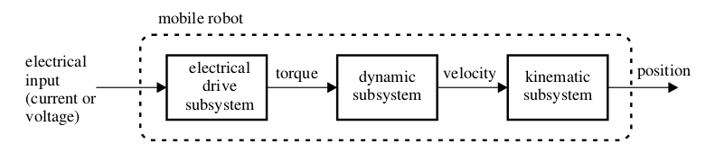
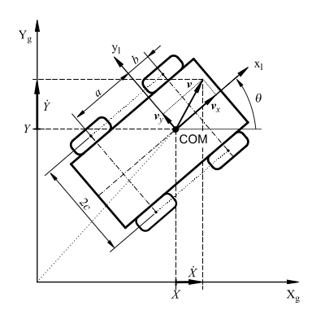
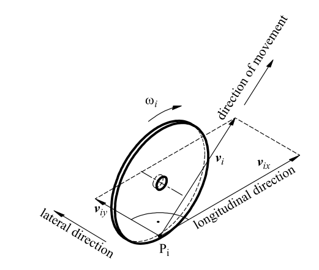
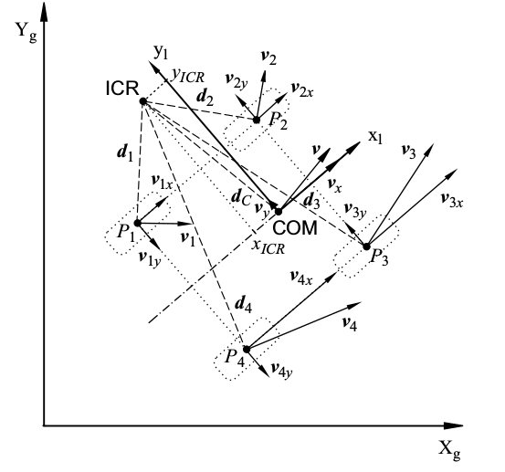

# pscontrol节点实现

> 何宇杰 180823

## I. 基本要求

<center>


<center><font size=2>**图1 ps3摇杆表示**</font></center> 

</center>

使用ps3手柄中的2个3D摇杆，一个读取数值大小控制v，另一个读取角速度大小，读取PS3手柄数据，实现输出电机占空比信息，并且具备一定程度的保护功能（无摇杆输入则自动衰减等）。

&nbsp;

## II. 相关信息

### 2.1 摇杆输入输出分析

- 输入

从[ROS wiki/ps3joy: Button number macros for C++](http://wiki.ros.org/ps3joy#Button_number_macros_for_C.2B-.2B-)结合上图可以得知，我们可以我们所需的摇杆为1,2两个摇杆

```c++
// note on plain values:
// stick axes go from 0 to +/-1

#define PS3_AXIS_STICK_LEFT_UPWARDS      1
#define PS3_AXIS_STICK_RIGHT_LEFTWARDS   2
```

- 输出

从[sensor_msgs/Joy Message](http://docs.ros.org/api/sensor_msgs/html/msg/Joy.html)我们可以了解有关手柄输出的msg的格式如下

```c++
Header header           # timestamp in the header is the time the data is received from the joystick
float32[] axes          # the axes measurements from a joystick
int32[] buttons         # the buttons measurements from a joystick 
```

### 2.2 相关主题

涉及的ROS主题：

- 订阅`/joy`主题，订阅的是操作手柄的输出，轴读取范围是[-1,1]

- 发布`/serial_send_mailbox`主题，发布的是电机占空比对应的八字节字符数组

八字节分别为类型为`int`四轮电机占空比FL.FR,RL,RR(左前，右前，左后，右后)导出成为字符数组经由串口通信节点发送给下位机stm32进行小车轮速实时控制。

### 2.3 理论支撑

小车属于SSMR（skid-steering mobile robot，滑移转向机器人）模型，主要靠车轮的打滑与四轮的差速进行转向，实际上由于轮胎与地面摩擦力过大，可能导致转向严重不足。

主要以***MODELING AND CONTROL OF A 4-WHEEL SKID-STEERING MOBILE ROBOT***一文中的运动学模型进行展开：

整车模型分解主要分为三个部分，电机输入，中间模型分析，最终速度位置输出，而本节点主要关注的运动学部分的信息处理（来自摇杆的预期输入以及解算后得到预期的速度输出）。



<center><font size=2>**图2 模型分解**</font></center> 

首先是结合图3声明整车的相关参数与变量：



<center><font size=2>**图3 整车模型参数表示**</font></center> 

| 符号         | 参数含义                          | 数值/(单位)      |
| ------------ | --------------------------------- | ---------------- |
| $X_g$, $Y_g$ | 二维世界坐标系                    |                  |
| $x_1$, $y_1$ | 二维小车坐标系（小车前进方向为x） |                  |
| $a$, $b$     | 质心到后/前排轮子的距离           | 约$0.4m$, $0.4m$ |
| $2c$         | 整车宽度                          | 约$ 0.6m $       |
| $v_x$, $v_y$ | 车身重心处纵向速度与侧向滑移速度  |                  |

经过参数定义后开始相关运动学的导出计算：






<center><font size=2>**图4 瞬心法实现的轮速图**</font></center>

其余动力学模型详见文中推倒。

&nbsp;

## III. 实现过程

### 3.1 src/pscontrol

#### 3.1.1 头文件

```c++
//ros头文件
#include "ros/ros.h"
//joy节点
#include <sensor_msgs/Joy.h>
//串口通讯头文件
#include <std_msgs/UInt8MultiArray.h>
#include <std_msgs/MultiArrayLayout.h>
//其他头文件
#include <string>        
#include <iostream>
#include <cstdio>
#include <unistd.h>
#include <cmath>
#include <cstring>
```

#### 3.1.2 参数定义

```c++
// 小车相关参数
//speed_motor(rpm) / reduce_ratio = m_outpit(rpm)
float reduce_ratio = 19.2; //减速比，电机内部参数
// convert from rpm to wheel_speed, wheel_ration = 2 * pi * D(m)] / 60(s/min)
// [m_outpit(rpm) * 2 * pi * D(m)] / 60(s/min) = wheel_speed(m/s)
float wheel_ratio = 0.0225; //轮边系数，电机输出转速与轮速关系系数
float half_width = 0.6; // 2c = width (m) 半宽度
float a = 0.4; //(m) 质心到后排轮子的距离
float b = 0.4; //(m) 质心到前排轮子的距离
int MAX_SPEED = 4000; //电机最高转速，可以到8000

// 定义主要结构体，并声明
struct center
{
    float v; // 中心（加）速度 
    float w; // 中心角（加）速度 
}ctr_vel,ctr_accl;

float vL, vR; //左右排纵向速度
float rpm[2]; //左右排电机转速，先左后右
short int rpm_conv[2]; //电机转速导出值

// 摇杆相关参数
int linear_ = 1;
int angular_ = 2; //joy对应摇杆3,ps3joy对应摇杆2
double l_scale_ = 2.0; //0.8
double a_scale_ = 1.0; //摇杆比例 1.0

//控制参数
float trap_width = 0.02; //1.0对应0.02
float v_downrate = 0.95; //速度衰减
float w_downrate = 0.75; //速度衰减
```

#### 3.1.3 函数

在说完头文件以及参数定以后，最后来说说函数，主要有三个函数组成`int rpm_convert(float rpm)`，`void callback(const sensor_msgs::Joy::ConstPtr& msg)`以及主函数。

- 占空比与电机转速转换函数 `int rpm_convert(float rpm)`

占空比与电机转速之间为折线的关系，在y2，y3之间有一段平台器，在正负转速极限到0位之间假设为线性关系。

```c++
int rpm_convert(float rpm)
{
    float y1; //负极限占空比
    float y2; //静止对应占空比下限
    float y3; //静止对应占空比上限
    float y4; //正极限占空比
    float k1, k2; //斜率
    y1 = 1000.0;
    y2 = 1480.0;
    y3 = 1520.0;
    y4 = 2000.0;
    float rpm_conv;
    if(rpm > 0) {
        rpm_conv = (y4 - y3) * rpm/MAX_SPEED + y3;
    }
    else if(rpm < 0) {
        rpm_conv = (y2 - y1) * rpm/MAX_SPEED + y2;
    }
    else rpm_conv = (y2 + y3)/2;

    return static_cast<short int>(rpm_conv);
}
```

- 回调函数 `void callback(const sensor_msgs::Joy::ConstPtr& msg)`

```c++
void callback(const sensor_msgs::Joy::ConstPtr& msg)
{
    //读取摇杆进行解算，参数l_scale_、a_scale_乘上对应摇杆的输出反馈值即为理想中心速度
    //ROS_INFO_STREAM(ctr_accl.v);
    ctr_accl.v = l_scale_*msg->axes[linear_];
    ctr_accl.w = a_scale_*msg->axes[angular_];
}
```

- 主函数 `int main(int argc, char **argv)`

首先是一些基本操作

```c++
{   
    // 初始中心速度为0
    center ctr_vel = {0.0,0.0};

    // !控制相关参数
    float dt = 0.02;//更新频率50Hz对应的时间

    ros::init(argc, argv, "pscontrol");//初始化节点
    ros::NodeHandle n;  //定义节点进程句柄

    n.param("axis_linear", linear_, linear_);
    n.param("axis_angular", angular_, angular_);
    n.param("scale_angular", a_scale_, a_scale_);
    n.param("scale_linear", l_scale_, l_scale_);

    ros::Subscriber sub = n.subscribe("joy", 2, callback); 
    ros::Publisher send_pub = n.advertise<std_msgs::UInt8MultiArray>("serial_send_mailbox", 2);       
    ros::Rate loop_rate(10); 
    while(ros::ok())
    {  
        // 下面循环部分此处缺省
        ...
    }
    return 0;
}
```

以下则为**循环部分**：

首先是声明需要发布的消息并进行一些基础配置：

```c++
        //std_msgs格式
        std_msgs::MultiArrayLayout msg;
        std_msgs::UInt8MultiArray v;
        const unsigned int data_sz = 8;
        v.layout.dim.push_back(std_msgs::MultiArrayDimension());
        v.layout.dim[0].size = data_sz;
        v.layout.dim[0].stride = 1; 
        v.layout.dim[0].label = "dutycycle_char"; 
        v.data.resize(data_sz);
```

接着为速度控制部分，主要实现的就是保证摇杆在中位的时候自动回0

```c++
        //速度控制（保证空摇杆自动回０）
        if(ctr_accl.v == 0)
        {
            ctr_vel.v = 0;
            // ctr_vel.v = ctr_vel.v * v_downrate;
            // // 进入置0陷阱
            // if (std::abs(ctr_vel.v) < trap_width)
            //     ctr_vel.v = 0;
        }
        else
        {
            ctr_vel.v += ctr_accl.v * dt;
        }
        //角速度控制（保证空摇杆自动回０）
        if(ctr_accl.w == 0)
        {
            ctr_vel.w = 0;
            // ctr_vel.w = ctr_vel.w * w_downrate;
        }
        else
        {
            // ctr_vel.w = ctr_accl.w * dt;
            ctr_vel.w = ctr_accl.w * 0.7853 / 2; // o.7853 = pi / 8
        }
```

然后根据2.3节中理论支撑部分我们得到的定义进行左右前后电机速度的解算并使用上述占空比与电机转速转换函数导出类型为int的占空比：

```c++
        //轮速转换，得出v(L/R)
        vL = ctr_vel.v - half_width * ctr_vel.w;
        vR = ctr_vel.v + half_width * ctr_vel.w;

        rpm[0] = vL * reduce_ratio / wheel_ratio; // (rpm)
        rpm[1] = vR * reduce_ratio / wheel_ratio; // (rpm)

        //极值与判定
        for(int i = 0;i < 2;i++)
        {
            if(abs(rpm[i]) >= MAX_SPEED) 
            {
                if(rpm[i] > 0) 
                    rpm[i] = MAX_SPEED;
                else 
                    rpm[i] = - MAX_SPEED;
                //ROS_INFO_STREAM("Reach Maximum Speed!");
            }
            rpm_conv[i] = rpm_convert(rpm[i]);
        }
```

最后将数据由rpm_conv转化为vector，并发布结束一次循环

本部分比较重要的是vector容器的使用需要小心谨慎！

```
        //数据转换由rpm_conv转化为vector
        std::vector<unsigned char> output 
            = {
               ((unsigned char*) rpm_conv)[0],
               ((unsigned char*) rpm_conv)[1],
               ((unsigned char*) rpm_conv)[2],
               ((unsigned char*) rpm_conv)[3],
               ((unsigned char*) rpm_conv)[0],
               ((unsigned char*) rpm_conv)[1],
               ((unsigned char*) rpm_conv)[2],
               ((unsigned char*) rpm_conv)[3]
            };
        v.data = output;
        send_pub.publish(v);
        ros::spinOnce();//周期执行
        loop_rate.sleep();//周期休眠
```

ps: 在debug过程中，可以使用形如`std::cout<<"2.中心速度："<<ctr_vel.v<<std::endl;`结合launch文件中的`output="screen“`在终端显示，正如断点。

### 3.2 package.xml

`package.xml`无特别之处，注意在依赖库分别添加有关`joy`三行即可。

```
  <build_depend>joy</build_depend>
  <build_export_depend>joy</build_export_depend>
  <exec_depend>joy</exec_depend>
```

### 3.3 CMakeLists.txt

`CMakeLists.txt`无特别之处，同上注意添加依赖`joy`库即可。

```cmake
find_package(catkin REQUIRED COMPONENTS
  roscpp
  std_msgs
  joy
)
```

### 3.4 launch文件

#### 3.4.1 说明

ps3_bringup.launch文件主要进行几个节点的统一以及参数的配置。

三个节点包括：**串口读取节点**，**摇杆信息节点**以及**ps3控制节点**三个组成部分。

四个参数`axis_linear`，`axis_angular`，`scale_linear`和`scale_angular`，以下是相关信息的表格：

| 参数            | 类型   | 含义                   | 值   |
| --------------- | ------ | ---------------------- | ---- |
| `axis_linear`   | int    | 前进方向线速度控制摇杆 | 1    |
| `axis_angular`  | int    | 转弯角速度控制摇杆     | 2    |
| `scale_linear`  | double | 前进方向线速度参数     | 0.8  |
| `scale_angular` | double | 转弯角速度参数         | 1.0  |

ps: 在节点处添加 `output="screen“`可以打印在终端辅助调试。

#### 3.4.2 代码

```xml
<launch>
 <!-- 串口读取节点 serial Node-->
 <node pkg="serial_stm2ros" type="serial_rw" name="serial" output="screen"/>
  
 <!-- 摇杆信息节点 joy node -->
<node respawn="true" pkg="joy"
      type="joy_node" name="joy">
  <param name="dev" type="string" value="/dev/input/js0"/>
  <param name="deadzone" value="0.10" />
</node>

 <!-- ps3控制节点 pscontrol node - Axes & Variable-->
 <!-- ps3设置速度控制为left-axis-upward，编号1;角度控制为right-axis-leftward.编号2-->
 <!-- output="screen 主要用于screen打印　-->
  <param name="axis_linear" value="1" type="int"/> //
  <param name="axis_angular" value="2" type="int"/> //
  <param name="scale_linear" value="0.8" type="double"/>
  <param name="scale_angular" value="1.0" type="double"/>
  <node pkg="pscontrol" type="pscontrol" name="ps3" output="screen"/>
</launch>
```

&nbsp;

## IV. 相关调试

- 打印调试内容

```
std::cout<<"1.摇杆角/加速度："<<ctr_accl.w<<ctr_accl.v<std::endl;
```

在属于node的tag添加`output = screen`可以实现将内容打印在**终端**上

- 操作与启动

```bash
# 使用ps3蓝牙配对并连接
$ sudo bash
# 配对
# 查看MAC地址
$ rosrun ps3joy sixpair
# 启动ps3joy控制节点
$ rosrun ps3joy ps3joy.py

#　启动节点
$ roslaunch pscontrol ps3_bringup.launch
```

具体内容可以参考[ROS Wiki: How to Pair the PS3 Joystick with a Bluetooth Dongle](http://wiki.ros.org/ps3joy/Tutorials/PairingJoystickAndBluetoothDongle)

&nbsp;

## V. 未来可开展工作

- ps3上的相关按键与摇杆数量较多，可以实现多种模式切换等复杂逻辑，或结合动态参数配置实现在线的调试加快开发的进行
- 可以尝试进行一系列控制方式的并行开发，目前常见的控制还包括键盘控制，wiimote手柄控制等

&nbsp;

## VI. 参考链接

### 6.1 主要拓展

- [ROS Wiki: ps3joy/Tutorials](http://wiki.ros.org/ps3joy/Tutorials/)
- [github: ros-drivers/joystick_drivers](https://github.com/ros-drivers/joystick_drivers)
- [ROS下使用wii游戏手柄控制移动机器人](http://stevenshi.me/2018/07/03/how-to-use-joystick/)

### 6.2 其他

**键盘控制：**

- [基于ROS平台的移动机器人-4-通过ROS利用键盘控制小车移动](https://blog.csdn.net/forrest_z/article/details/55002484)

- [ROS Wiki: teleop_twist_keyboard](http://wiki.ros.org/teleop_twist_keyboard)

**WIIMOTE控制：**

- [ROS Wiki: wiimote](http://wiki.ros.org/wiimote?distro=melodic)
